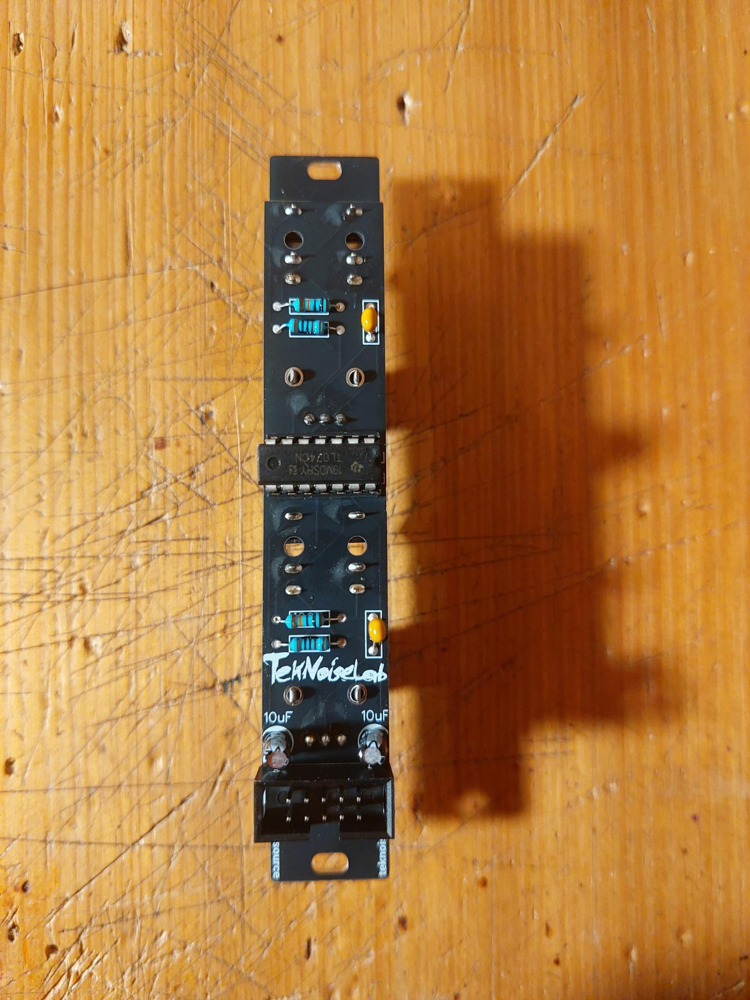

# simple-slew-limiter
This is just a very basic 2x slew limiter for Eurorack.
Few components, easy to build, and it does the job.

## Build
- Order the PCBs from the PCB manufacturer of your choice.
- Order the components from your favorite electronics supplier.
- Just solder the components to the PCB and mount the panel.

